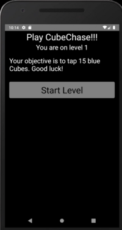
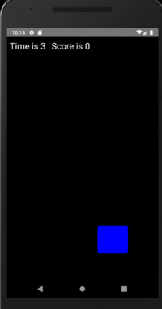
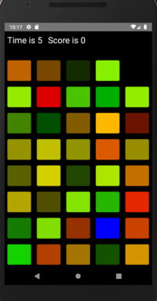

# Cube Chase Mobile

## About

Cube Chase Mobile is a simple mobile game that challenges the player
to tap the target cubes for the best time. It features multiple
levels of difficulty.





## Build Requirements

* Java SE or OpenJDK >= 8 and < 16
* Node 10 or newer
* [Android Studio](https://developer.android.com/studio/index.html) With the Android SDK specified in the [documentation](https://reactnative.dev/docs/0.60/enviroment-setup)
* [Watchman](https://facebook.github.io/watchman/docs/install/#buildinstall)

## How do I get React Native set up? ##

Follow the React Native guide for [Getting Started](https://reactnative.dev/docs/0.60/enviroment-setup)
Follow the CLI guide, not the Expo guide.

## How to run this project ##

First make a file `andoird/local.properties` and specify the Android SDK location in there.

On Linux this looks like `sdk.dir = /home/USERNAME/Android/Sdk`

Then:

```cd CubeChase```

```npm i```

```npm start```

```npm run android``` (in a separate terminal)

## Contribution guidelines ##

This project is not being worked on. It was a learning tool for me.
Feel free to use it however you would like.